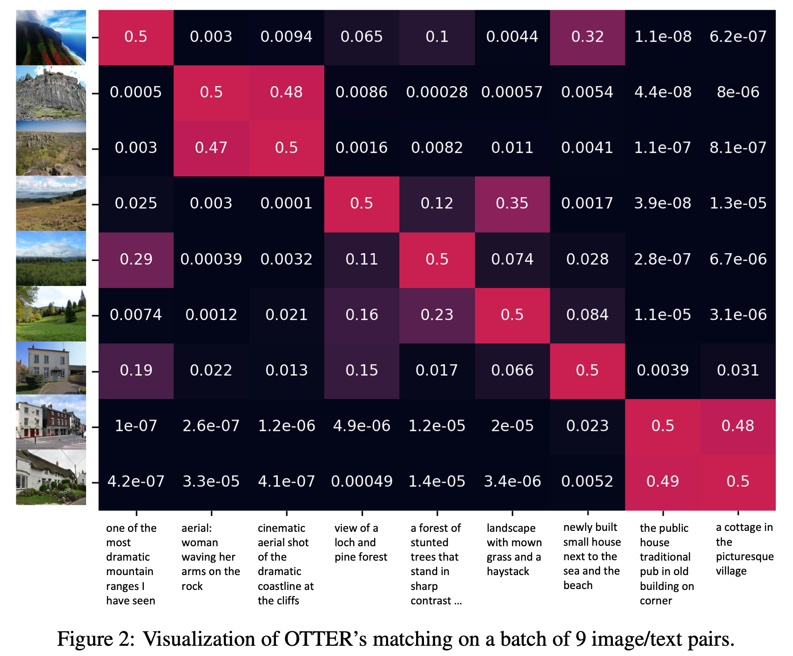

# Data Efficient Language-Supervised Zero-Shot Recognition with Optimal Transport Distillation
This repository contains PyTorch evaluation code, training code and pretrained models for **OTTER** (**O**ptimal 
**T**ranspor**t** distillation for **E**fficient zero-shot **R**ecognition). Link to the [paper](https://arxiv.org/abs/2112.09445). 

Bichen Wu<sup>\*</sup>, Ruizhe Cheng<sup>\*</sup>, Peizhao Zhang, Tianren Gao, Joseph E. Gonzalez, Peter Vajda (* indicates equal contribution)



If you used this code for your experiments, please consider citing our paper:
```
@inproceedings{otter,
    Author = {Wu, Bichen and Cheng, Ruizhe and Zhang, Peizhao and Vajda, Peter and Gonzalez, Joseph E},
    Title = {Data Efficient Language-supervised Zero-shot Recognition with Optimal Transport Distillation},
    Journal = {arXiv:2112.09445},
    Year = {2021}
}

```
And our related work:
```
@inproceedings{cheng2021data,
  title={Data-Efficient Language-Supervised Zero-Shot Learning with Self-Distillation},
  author={Cheng, Ruizhe and Wu, Bichen and Zhang, Peizhao and Vajda, Peter and Gonzalez, Joseph E},
  booktitle={Proceedings of the IEEE/CVF Conference on Computer Vision and Pattern Recognition},
  pages={3119--3124},
  year={2021}
}
```

## Model Zoo
OTTER achieves good zero-shot image recognition results on multi-labeled 
[Google Open Images V6](https://storage.googleapis.com/openimages/web/index.html) and ImageNet10K from 
[Tencent Images](https://github.com/Tencent/tencent-ml-images).


| Dataset |  Method | Image Encoder |   Text Encoder   | GOI F@K=1 | GOI F@K=5 | GOI F@K=10 | IN10K F@K=1 | IN10K F@K=5 | IN10K F@K=10 |  url  |
|:-------:|:-------:|:-------------:|:----------------:|:---------:|:---------:|:----------:|:-----------:|:-----------:|:------------:| :----:|
|  CC 3M  | InfoNCE |      RN50     | DeCLUTR-Sci-base |    26.8   |    55.1   |    66.4    |     10.9    |     29.4    |     40.5     |[model]()|
|  CC 3M  |    LS   |      RN50     | DeCLUTR-Sci-base |    26.3   |    55.9   |    67.5    |     10.1    |     29.6    |     39.8     |[model]()|
|  CC 3M  |    KD   |      RN50     | DeCLUTR-Sci-base |    26.7   |    55.3   |    67.1    |     10.0    |     27.5    |     38.5     |[model]()|
|  CC 3M  |  OTTER  |      RN50     | DeCLUTR-Sci-base |    29.1   |    59.6   |    70.9    |     12.0    |     31.8    |     42.1     |[model]()|


## Usage
First, git clone the repository
```shell script
git clone https://github.com/facebookresearch/OTTER.git
```
Then, install required packkages using pip
```shell script
conda create --name otter python=3.8
conda activate otter
pip install -r requirements.txt
```

Try out classifying with a pretrained OTTER or one of its baseline models.
```python
import torch
from PIL import Image
import otter

device = "cuda" if torch.cuda.is_available() else "cpu"
temperature = 60

model, preprocess = otter.load("OTTER") # KD, LS, InfoNCE
model = model.to(device)

image = Image.open("doge.jpg")
image = preprocess(image).unsqueeze(0).to(device)
texts = ['photo of a dog', 'photo of a sofa', 'photo of a flower']

with torch.no_grad():
    features = model.forward_features(image, texts)
    image_logits, text_logits = model.compute_logits(features)
    image_logits *= temperature

    probs = image_logits.softmax(dim=-1).cpu().numpy()

print("Probs:", probs)  # Probs: [[0.92657197 0.00180788 0.07162025]]
```

## Evaluation
You can evaluate a pretrained model with `launch_scripts/eval.sh`.

Note that for faster evaluation, we used FAISS for knn lookup. The result however will be slightly different from using sklearn knn functions. 

## Data preparation
Download the Conceptual Caption or YFCC 15M (subset of YFCC100M) dataset for training. 
Download Google Open Images's or ImageNet 10K's test set for evaluation.

### Conceptual Captions
First, download ``Train-GCC-training.tsv``, which contains captions and image urls, from the [official CC website](https://ai.google.com/research/ConceptualCaptions/download).
Then, follow the instructions in [this repo](https://github.com/igorbrigadir/DownloadConceptualCaptions) to efficiently download Conceptual Captions.
After the download completes, there should be a ``downloaded_training_report.tsv``. Make sure it's in the same cc root folder as `Train-GCC-training.tsv` along with the `training` folder that contains all the images.

Run `python data/cc_preprocess.py --cc_root /data/cc` to generate a `processed_labels.csv`, which contains paired image paths and captions. 
This preprocessing step filters out invalid images that can't be opened by PIL. Note that not all images in the conceptual captions dataset are available. 
In our case, we had 2911810 valid images from the train set of conceptual captions. 

### YFCC 15M
Follow the instructions in [here](https://gitlab.com/jfolz/yfcc100m/-/issues/2) to download the 15 million 
images which were used in training CLIP.

After downloading all the zip files, convert the zip files to datadings format (with compression if necessary). In 
`data/yfcc.py`, the YFCC dataset takes in the `datadings` folder.

### Google Open Images
Download the test set of Google Open Images V6 from [here](https://storage.googleapis.com/openimages/web/download.html).
We have provided the class names and label annotations in the `dataset_meta_data` folder.


### ImageNet 10K (from Tencent ML-Images)
You can also evaluate on the validation set of multi-labeled ImageNet 10K from Tencent ML-Images. 
Download the ImageNet portion of Tencent ML-Images from [here](https://github.com/Tencent/tencent-ml-images#download-images-from-imagenet).
We have also included the class names and label annotations in the `dataset_meta_data` folder.

The datasets should be placed in the following way:
```
DATA_ROOT/
  cc/
    processed_labels.csv
    training/
      ... (images)
  open-images/
    test/
      ... (images)
  tencent/
    images/
      ... (images)
```

## Single node training 
You can launch training on a single node with scripts in `launch_scripts`.


## Dataset Analysis
You can analyze the prevalence of the noisy matching problem with `python3 data_analysis.py --data_root <data_root> --datasets cc --batch 512 --stop 1000`.
The script uses a pretrained OpenAI CLIP model to estimate the the on-diagonal vs off-diagonal matching scores of an image-caption dataset.

## License
This source code is licensed under the MIT license found in the [LICENSE](LICENSE) file in the root directory of this source tree.
